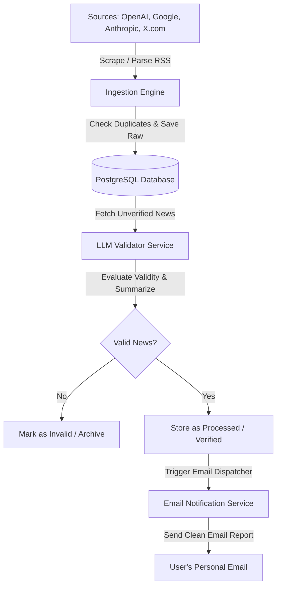

# AI News Aggregator & LLM Validator

A containerized Node.js backend system that aggregates AI news from platforms like OpenAI, Google, Anthropic, and X.com, filters and evaluates them using a Large Language Model (LLM) for validity and quality, stores them in a PostgreSQL database, and sends curated email updates to a designated email address.

---

## 1. System Architecture



### Key Workflow Components
1. **Ingestion Engine**: Triggered periodically by a scheduler. Fetches articles, posts, or RSS feed items from target domains.
2. **Database Layer (PostgreSQL)**: Stores both raw crawled inputs (to ensure we never process the same article twice) and LLM-verified outputs.
3. **LLM Validation Service**: Connects to an LLM provider (e.g., Gemini or OpenAI) using structured schema outputs to evaluate whether a news item is valid, interesting, non-duplicate, and of high value.
4. **Notification Engine**: Uses Nodemailer to format and send clean, responsive HTML emails with verified news summaries and links.
5. **Scheduler**: Runs internal cron schedules for ingestion, LLM evaluation, and email dispatching.

---

## 2. Directory Structure

```text
news-aggregator/
├── .env.example                 # Template for environment configuration
├── .gitignore                   # Files and directories to ignore in git
├── Dockerfile                   # Docker image blueprint for the Node.js application
├── docker-compose.yml           # Multi-container orchestration (App & PostgreSQL)
├── package.json                 # Project metadata, scripts, and dependencies
├── README.md                    # Project documentation and setup guide
└── src/
    ├── app.js                   # Application entry point
    ├── config/
        ├── database.js          # PostgreSQL connection and pool configuration
        ├── env.js               # Environment variables parsing and validation
        └── logger.js            # Structured logger setup (winston/pino)
    ├── database/
        ├── init.sql             # SQL script for database schema initialization
        └── queries.js           # Database queries interface
    ├── jobs/
        ├── scheduler.js         # Cron job coordinator
        ├── ingestJob.js         # News scraping and ingestion task
        ├── validatorJob.js      # LLM evaluation task
        └── emailJob.js          # Daily/Hourly digest dispatcher task
    ├── services/
        ├── ingestion/
            ├── index.js         # Unified ingestion service
            ├── openai.js        # OpenAI blog parser
            ├── google.js        # Google AI blog parser
            ├── anthropic.js     # Anthropic blog parser
            └── twitter.js       # X.com scraping adapter
        ├── llm/
            ├── index.js         # Unified LLM provider router
            ├── gemini.js        # Google Gemini API integration
            └── openai.js        # OpenAI GPT API integration
        └── notification/
            ├── email.js         # Nodemailer setup and template compiler
            └── templates/
                └── digest.html  # HTML email layout
    └── utils/
        └── helpers.js           # Shared utility functions
```

---

## 3. Database Schema

The system uses three core tables inside PostgreSQL to manage data flow:

```sql
-- Initial Schema Definition

-- Table 1: Ingestion Sources
CREATE TABLE IF NOT EXISTS sources (
    id SERIAL PRIMARY KEY,
    name VARCHAR(50) NOT NULL UNIQUE, -- e.g., 'openai', 'google', 'anthropic', 'twitter'
    url VARCHAR(255) NOT NULL,
    is_active BOOLEAN DEFAULT TRUE,
    last_polled_at TIMESTAMP WITH TIME ZONE
);

-- Table 2: Raw Scraped News (to prevent processing duplication)
CREATE TABLE IF NOT EXISTS raw_articles (
    id SERIAL PRIMARY KEY,
    source_id INT REFERENCES sources(id) ON DELETE CASCADE,
    external_id VARCHAR(255) UNIQUE, -- Unique hash of URL or API post ID
    title VARCHAR(500) NOT NULL,
    url VARCHAR(1000) NOT NULL,
    published_at TIMESTAMP WITH TIME ZONE,
    raw_content TEXT,
    created_at TIMESTAMP WITH TIME ZONE DEFAULT CURRENT_TIMESTAMP,
    status VARCHAR(20) DEFAULT 'pending' -- 'pending', 'processed', 'failed'
);

-- Table 3: LLM Verified & Summarized Articles
CREATE TABLE IF NOT EXISTS processed_articles (
    id SERIAL PRIMARY KEY,
    raw_article_id INT REFERENCES raw_articles(id) ON DELETE CASCADE,
    is_valid BOOLEAN NOT NULL DEFAULT FALSE,
    relevance_score INT CHECK (relevance_score BETWEEN 0 AND 100),
    summary TEXT,
    key_takeaways JSONB, -- Array of bullet points
    category VARCHAR(100), -- e.g., 'LLM Release', 'Hardware', 'Corporate'
    verified_at TIMESTAMP WITH TIME ZONE DEFAULT CURRENT_TIMESTAMP,
    email_sent BOOLEAN DEFAULT FALSE,
    email_sent_at TIMESTAMP WITH TIME ZONE
);

-- Indexes for performance
CREATE INDEX IF NOT EXISTS idx_raw_articles_status ON raw_articles(status);
CREATE INDEX IF NOT EXISTS idx_processed_articles_sent ON processed_articles(email_sent) WHERE is_valid = TRUE;
```

---

## 4. LLM Verification Strategy

Each scraped article undergoes an LLM review before being queued for notification. To keep processing costs low and quality high:
1. **Payload**: The system sends the `title`, `source`, and a snippet of `raw_content` to the LLM.
2. **System Prompt**: Enforces a strict response structure (using JSON schema validation/structured outputs).
3. **Evaluation Metric**:
   - **Is Valid AI News**: Filters out noise, financial speculation, generic articles, and spam.
   - **Relevance Score**: Rates importance from 0 (insignificant) to 100 (groundbreaking news like GPT-5 launch).
   - **Summary**: A concise 2-sentence summary.
   - **Key Takeaways**: 3 clear bullet points summarizing impact.

---

## 5. Environment Configuration (`.env.example`)

```env
# Application Details
PORT=3000
NODE_ENV=development

# Database Configuration
DB_HOST=postgres
DB_PORT=5432
DB_USER=news_user
DB_PASSWORD=news_password
DB_NAME=news_db

# LLM Providers Configuration
LLM_PROVIDER=gemini # 'gemini' or 'openai'
GEMINI_API_KEY=your_gemini_api_key_here
OPENAI_API_KEY=your_openai_api_key_here

# Notification Settings
EMAIL_HOST=smtp.gmail.com
EMAIL_PORT=587
EMAIL_USER=your_sending_email@gmail.com
EMAIL_PASS=your_app_specific_password_here
TARGET_EMAIL=your_personal_email@domain.com

# Scraper Schedules (Cron Patterns)
SCRAPE_CRON="*/30 * * * *" # Every 30 minutes
LLM_VERIFY_CRON="*/10 * * * *" # Every 10 minutes
EMAIL_DIGEST_CRON="0 9 * * *" # Daily at 9:00 AM
```

---

## 6. Dockerization

The project uses Docker and Docker Compose to ensure a reproducible environment with isolated Node.js and PostgreSQL runtimes.

### docker-compose.yml
```yaml
version: '3.8'

services:
  postgres:
    image: postgres:15-alpine
    container_name: news_postgres
    restart: always
    environment:
      POSTGRES_DB: ${DB_NAME:-news_db}
      POSTGRES_USER: ${DB_USER:-news_user}
      POSTGRES_PASSWORD: ${DB_PASSWORD:-news_password}
    ports:
      - "5432:5432"
    volumes:
      - postgres_data:/var/lib/postgresql/data
      - ./src/database/init.sql:/docker-entrypoint-initdb.d/init.sql
    healthcheck:
      test: ["CMD-SHELL", "pg_isready -U ${DB_USER:-news_user} -d ${DB_NAME:-news_db}"]
      interval: 10s
      timeout: 5s
      retries: 5

  app:
    build: .
    container_name: news_backend
    restart: always
    ports:
      - "${PORT:-3000}:${PORT:-3000}"
    environment:
      - NODE_ENV=${NODE_ENV:-development}
      - DB_HOST=postgres
      - DB_PORT=5432
      - DB_USER=${DB_USER}
      - DB_PASSWORD=${DB_PASSWORD}
      - DB_NAME=${DB_NAME}
      - LLM_PROVIDER=${LLM_PROVIDER}
      - GEMINI_API_KEY=${GEMINI_API_KEY}
      - OPENAI_API_KEY=${OPENAI_API_KEY}
      - EMAIL_HOST=${EMAIL_HOST}
      - EMAIL_PORT=${EMAIL_PORT}
      - EMAIL_USER=${EMAIL_USER}
      - EMAIL_PASS=${EMAIL_PASS}
      - TARGET_EMAIL=${TARGET_EMAIL}
      - SCRAPE_CRON=${SCRAPE_CRON}
      - LLM_VERIFY_CRON=${LLM_VERIFY_CRON}
      - EMAIL_DIGEST_CRON=${EMAIL_DIGEST_CRON}
    depends_on:
      postgres:
        condition: service_healthy
    volumes:
      - .:/usr/src/app
      - /usr/src/app/node_modules

volumes:
  postgres_data:
```

---

## 7. Project Setup & Execution Commands

### Prerequisites
- Node.js installed locally (v18+)
- Docker and Docker Compose installed and running

### Step 1: Initialize Project Files
Run these commands in your terminal to initialize files and directories:

```bash
# Create directory structure
mkdir -p src/config src/database src/jobs src/services/ingestion src/services/llm src/services/notification/templates src/utils

# Initialize package.json
npm init -y
```

### Step 2: Install Required Dependencies
```bash
# Core Dependencies
npm install pg dotenv node-cron nodemailer axios cheerio rss-parser @google/generative-ai openai winston

# Development Dependencies
npm install --save-dev nodemon
```

### Step 3: Local Launch with Docker
1. Create a `.env` file copying the values from `.env.example`.
2. Spin up the containers:
   ```bash
   docker-compose up -d --build
   ```
3. To view application logs:
   ```bash
   docker-compose logs -f app
   ```

---

## 8. Implementation Steps & Execution Plan

### Phase 1: Setup & Environment Validation
- Configure basic folder structures, `package.json`, `.env` loaders, and Docker configuration files.
- Write `src/config/env.js` to assert the existence of required environment credentials (API keys, SMTP configs, Database settings).

### Phase 2: Database Initialization
- Launch PostgreSQL inside docker-compose.
- Initialize database schemas and verify connection logic inside `src/config/database.js`.

### Phase 3: Scraping & Ingestion Modules
- Implement independent crawlers/RSS readers in `src/services/ingestion/`:
  - RSS parser targeting blogs of OpenAI, Google AI, and Anthropic.
  - Social platform (X.com) crawler interface.
- Implement deduplication logic checking the `raw_articles` unique constraint.

### Phase 4: LLM Verification Integration
- Setup LLM client matching user choice (Gemini/OpenAI).
- Design system prompts utilizing JSON output parameters.
- Verify evaluation parameters by executing mock news payloads.

### Phase 5: Notification Service
- Build clean custom HTML emails displaying verified news in dynamic grids.
- Implement SMTP/Nodemailer sending client with error recovery logic.

### Phase 6: Scheduler & Operations
- Coordinate ingestion, evaluation, and dispatch schedules under a robust Node-Cron worker suite inside the Node process.
