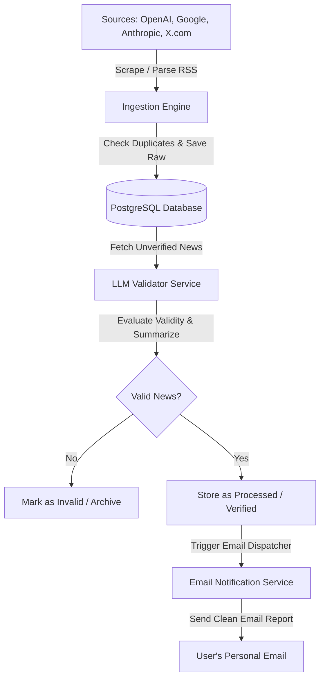

# NEWS AI: AI News Aggregator 

> **If you are into the field of AI, you must try this!**

In a fast-paced ecosystem where breakthrough research, models, and industry updates are announced daily, information overload is a real challenge. **newsAI** is an automated, self-healing pipeline built to solve this. It systematically aggregates AI updates from primary sources, filters out the noise using Large Language Models (LLMs) with structured verification, and delivers a clean, high-signal intelligence digest directly to your inbox.

### Why newsAI was built
- **Noise Elimination**: Most AI news feeds are cluttered with financial speculation, generic articles, and duplicate content. newsAI evaluates every piece of news using advanced LLM reasoning to ensure relevance.
- **Automation-First**: Operates on modular scheduler cron instances, ensuring hands-off polling, processing, and dispatching.
- **Developer-Friendly & Robust**: Containerized, pre-seeded, and includes local mock LLM fallbacks for smooth offline testing.

---

## 1. System Architecture



### Key Workflow Components
1. **Ingestion Engine**: Triggered periodically by a scheduler. Fetches articles, posts, or RSS feed items from target domains.
2. **Database Layer (PostgreSQL)**: Stores both raw crawled inputs (to ensure we never process the same article twice) and LLM-verified outputs.
3. **LLM Validation Service**: Connects to an LLM provider (e.g., Gemini or OpenAI) using structured schema outputs to evaluate whether a news item is valid, interesting, non-duplicate, and of high value.
4. **Notification Engine**: Uses Nodemailer to format and send clean, responsive HTML emails with verified news summaries and links.
5. **Scheduler**: Runs internal cron schedules for ingestion, LLM evaluation, and email dispatching.

---

## 2. Directory Structure

```text
news-aggregator/
├── .env.example                 # Template for environment configuration
├── .gitignore                   # Files and directories to ignore in git
├── Dockerfile                   # Docker image blueprint for the Node.js application
├── docker-compose.yml           # Multi-container orchestration (App & PostgreSQL)
├── package.json                 # Project metadata, scripts, and dependencies
├── README.md                    # Project documentation and setup guide
└── src/
    ├── app.js                   # Application entry point
    ├── config/
        ├── database.js          # PostgreSQL connection and pool configuration
        ├── env.js               # Environment variables parsing and validation
        └── logger.js            # Structured logger setup (winston/pino)
    ├── database/
        ├── init.sql             # SQL script for database schema initialization
        └── queries.js           # Database queries interface
    ├── jobs/
        ├── scheduler.js         # Cron job coordinator
        ├── ingestJob.js         # News scraping and ingestion task
        ├── validatorJob.js      # LLM evaluation task
        └── emailJob.js          # Daily/Hourly digest dispatcher task
    ├── services/
        ├── ingestion/
            ├── index.js         # Unified ingestion service
            ├── openai.js        # OpenAI blog parser
            ├── google.js        # Google AI blog parser
            ├── anthropic.js     # Anthropic blog parser
            └── twitter.js       # X.com scraping adapter
        ├── llm/
            ├── index.js         # Unified LLM provider router
            ├── gemini.js        # Google Gemini API integration
            └── openai.js        # OpenAI GPT API integration
        └── notification/
            ├── email.js         # Nodemailer setup and template compiler
            ├── templates/
                └── digest.html  # HTML email layout
    └── utils/
        └── helpers.js           # Shared utility functions
```

---

## 3. Database

The system uses three primary tables inside PostgreSQL to manage data flow. Below are the key components of the database model:

### Tables & Relationships
1. **`sources`**: Tracks the ingestion targets (e.g., OpenAI, Google AI, Anthropic, X.com).
   - *Key Columns*: `id`, `name` (unique), `url`, `is_active`, `last_polled_at`.
2. **`raw_articles`**: Stores all crawled/scraped articles to prevent duplicate processing.
   - *Key Columns*: `id`, `source_id` (foreign key to `sources`), `external_id` (unique hash of url/id), `title`, `url`, `published_at`, `raw_content`, `status` (`pending`, `processed`, `failed`).
3. **`processed_articles`**: Stores the output of LLM evaluations and notification tracking.
   - *Key Columns*: `id`, `raw_article_id` (foreign key to `raw_articles`), `is_valid` (boolean), `relevance_score` (0-100), `summary` (text), `key_takeaways` (JSONB list of points), `category`, `email_sent`, `email_sent_at`.

### Core Database Features
*   **Duplicate Prevention**: An index on `external_id` utilizes `ON CONFLICT DO NOTHING` logic to guarantee that no article is scraped or processed twice.
*   **Seeded Sources**: The schema contains initial seeds for primary platforms (OpenAI, Google, Anthropic, X.com) to start working instantly.
*   **Optimized Performance**: Indexes are placed on `raw_articles(status)` and `processed_articles(email_sent)` to optimize scheduler polling times.

---

## 4. LLM Verification Strategy

Each scraped article undergoes an LLM review before being queued for notification. To keep processing costs low and quality high:
1. **Payload**: The system sends the `title`, `source`, and a snippet of `raw_content` to the LLM.
2. **System Prompt**: Enforces a strict response structure (using JSON schema validation/structured outputs).
3. **Evaluation Metric**:
   - **Is Valid AI News**: Filters out noise, financial speculation, generic articles, and spam.
   - **Relevance Score**: Rates importance from 0 (insignificant) to 100 (groundbreaking news like GPT-5 launch).
   - **Summary**: A concise 2-sentence summary.
   - **Key Takeaways**: 3 clear bullet points summarizing impact.
   - **Category**: Classifies content (e.g., 'LLM Release', 'Hardware', 'Research').

---

## 5. Environment Configuration

The application is configured using a `.env` file. A template is provided in `.env.example`:

| Variable | Description | Default / Example |
| :--- | :--- | :--- |
| `PORT` | Local port for health diagnostics dashboard | `3000` |
| `NODE_ENV` | Environment mode | `development` |
| `DB_HOST` | Database host name (`postgres` for Docker, `localhost` for Local) | `postgres` |
| `DB_PORT` | PostgreSQL port | `5432` |
| `DB_USER` | PostgreSQL user | `news_user` |
| `DB_PASSWORD` | PostgreSQL password | `news_password` |
| `DB_NAME` | PostgreSQL database name | `news_db` |
| `LLM_PROVIDER` | Selected LLM provider (`gemini` or `openai`) | `gemini` |
| `GEMINI_API_KEY` | Google Gemini API Key | `your_api_key` |
| `OPENAI_API_KEY` | OpenAI API Key (if selected) | `your_api_key` |
| `EMAIL_HOST` | SMTP server host | `smtp.gmail.com` |
| `EMAIL_PORT` | SMTP port | `587` |
| `EMAIL_USER` | SMTP username | `your_email@gmail.com` |
| `EMAIL_PASS` | App-specific email password | `your_app_pass` |
| `TARGET_EMAIL` | Destination email for digests | `recipient@domain.com` |
| `SCRAPE_CRON` | Cron interval for scraping feeds | `*/30 * * * *` (30 mins) |
| `LLM_VERIFY_CRON`| Cron interval for validating articles | `*/10 * * * *` (10 mins) |
| `EMAIL_DIGEST_CRON`| Cron interval for sending newsletters | `0 9 * * *` (9:00 AM) |

---

## 6. Dockerization

The project uses Docker and Docker Compose to containerize the application and database, guaranteeing a seamless, isolated environment.

### Multi-Container Setup
1.  **`postgres` Service**: Uses `postgres:15-alpine` to host the database. It mounts a persistent docker volume (`postgres_data`) so data survives container restarts, and maps the `init.sql` script to auto-initialize the database schema.
2.  **`app` Service**: Builds the Node.js runtime using the local `Dockerfile` (using `node:20-alpine`). It is configured to run `npm start` (or nodemon) and mounts the code for live hot-reloading in development.

### Useful Docker Commands

*   **Build and Start Containers (detached mode)**:
    ```bash
    docker compose up -d --build
    ```
*   **Check Services Status**:
    ```bash
    docker compose ps
    ```
*   **View Real-Time Application Logs**:
    ```bash
    docker compose logs -f app
    ```
*   **Stop and Remove Containers (keeping data)**:
    ```bash
    docker compose down
    ```
*   **Stop and Wipe Containers (deleting database data)**:
    ```bash
    docker compose down -v
    ```

---

## 7. How to Run Locally (Without Docker)

If you prefer to run the aggregator directly on your host machine:

### Prerequisites
*   Node.js (v20 or higher)
*   A running PostgreSQL instance on your machine

### Setup Steps
1.  **Install dependencies**:
    ```bash
    npm install
    ```
2.  **Create Environment File**:
    Copy `.env.example` into a new `.env` file:
    ```bash
    cp .env.example .env
    ```
3.  **Adjust DB configuration in `.env`**:
    Change `DB_HOST` from `postgres` to `localhost` (or your local Postgres host IP) and verify that `DB_USER`, `DB_PASSWORD`, and `DB_NAME` match your local Postgres setup.
4.  **Initialize Database Schema**:
    Connect to your local PostgreSQL instance and execute the commands inside `src/database/init.sql` to set up the tables and seeds.
5.  **Start the Application**:
    *   **Development Mode (with auto-reload)**:
        ```bash
        npm run dev
        ```
    *   **Production Mode**:
        ```bash
        npm start
        ```
6.  **Verify Health Dashboard**:
    Open `http://localhost:3000/health` in your browser to verify that the app is connected to the database and schedules are initialized.
